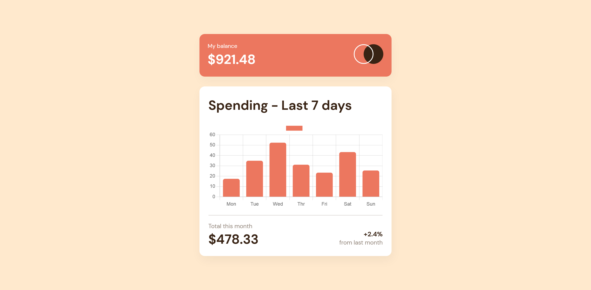

# Expenses Chart Component

This is a solution to the [Expenses chart component challenge on Frontend Mentor](https://www.frontendmentor.io/challenges/expenses-chart-component-e7yJBUdjwt).

## Table of contents

- [Overview](#overview)
  - [The challenge](#the-challenge)
  - [Screenshot](#screenshot)
  - [Links](#links)
- [My process](#my-process)
  - [Built with](#built-with)
  - [What I learned](#what-i-learned)
  - [Continued development](#continued-development)
  - [Useful resources](#useful-resources)
- [Author](#author)
- [Acknowledgments](#acknowledgments)

## Overview

### The challenge

Users should be able to:

- View the bar chart and hover over the individual bars to see the correct amounts for each day
- See the current day’s bar highlighted in a different colour to the other bars
- View the optimal layout for the content depending on their device’s screen size
- See hover states for all interactive elements on the page
- **Bonus**: Use the JSON data file provided to dynamically size the bars on the chart

### Screenshot



### Links

- Solution URL: [Github](https://github.com/SameerJS6/React-Project/tree/master/Expenses-Chart)
- Live Site URL: [Netify](https://expenses-chart-singh.netlify.app/)

## My process

- I started this project by breaking the design into smaller parts like the top bar and main content.
- I made the top bar first, which is just two things i.e. Logo and Title.
- Then I made the main content, which has a big part for the chart.
- I used a library called ChartJS to make the chart. Finally, I added some animations and did some clean up.

### Built with

- Flexbox
- Mobile-first workflow
- CSS custom properties
- Semantic HTML5 markup
- [React](https://reactjs.org/) - JS library
- [ChartJS](https://react-chartjs-2.js.org/) - React Library

### What I learned

- I learned how to organize my files(File Structure) and what components are and how to use them.
- I also learned how to use a library called ChartJS to make vertical bar charts. Here's some code that shows how it works:-

```javascript react
const state = {
  labels: ["Mon", "Tue", "Wed", "Thr", "Fri", "Sat", "Sun"],
  datasets: [
    {
      label: "",
      backgroundColor: "hsl(10, 79%, 65%)",
      hoverBackgroundColor: "hsl(186, 34%, 60%)",
      borderRadius: 5,
      data: [17.45, 34.91, 52.36, 31.07, 23.39, 43.28, 25.48],
    },
  ],
};
```

### Continued development

- I'm just starting out with React and I plan to keep learning and working with it

### Useful resources

- [React-ChartJS](https://react-chartjs-2.js.org/) - This helped me build the chart dynamically by using the provided data. I really liked this library and will use it going forward.

## Author

- Website - [Github](https://github.com/SameerJS6)
- Frontend Mentor - [@SameerJS6](https://www.frontendmentor.io/profile/Sameerjs6)

## Acknowledgments

- Props to Google,Youtube.
