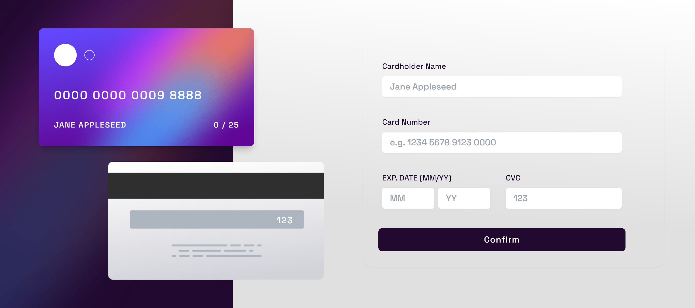

# Interactive Card Details Form Solution

This is a solution to the [Interactive card details form challenge on Frontend Mentor](https://www.frontendmentor.io/challenges/interactive-card-details-form-XpS8cKZDWw). Frontend Mentor challenges help you improve your coding skills by building realistic projects.

## Table of contents

- [Overview](#overview)
  - [The challenge](#the-challenge)
  - [Screenshot](#screenshot)
  - [Links](#links)
- [My process](#my-process)
  - [Built with](#built-with)
  - [What I learned](#what-i-learned)
  - [Continued development](#continued-development)
- [Author](#author)

## Overview

### The challenge

Users should be able to:

- Fill in the form and see the card details update in real-time
- Receive error messages when the form is submitted if:
  - Any input field is empty
  - The card number, expiry date, or CVC fields are in the wrong format
- View the optimal layout depending on their device's screen size
- See hover, active, and focus states for interactive elements on the page

### Screenshot

Desktop Preview


### Links

- Solution URL: [Github](https://github.com/SameerJS6/React-Projects/tree/master/Interactive-Card-Component)
- Live Site URL: [Netify](https://interactive-card-singh.netlify.app/)

## My process

- There isn't much to describe about this project as it was relatively easy.
- I started by creating two grid columns, one for the front and back of the card and the other for the form and confirm component.
- The toughest part was designing the cards, as I used the "position: absolute" property to style it and keep it in the proper position.
- This was my first time using Tailwind CSS, so the codebase was a bit confusing and messy.

### Built with

- Flexbox
- CSS Grid
- [React](https://reactjs.org/) - JS library
- Mobile-first workflow
- CSS custom properties
- Semantic HTML5 markup
- [Tailwind CSS](https://tailwindcss.com/) - CSS Framework

### What I learned

1. It wasn't that hard of challenge but nevertheless, learned to use onChange Event Listener in react for the first time. Was Fun to make this [Interactive Card Component](https://www.frontendmentor.io/challenges/interactive-card-details-form-XpS8cKZDWw).
1. Doing proper form validation in React was also a new and interesting experience for me.
1. Additionally, I got to practice using regular expressions for validating the card number and CVC inputs, See below:-

```Javascript React
 const regex = (input, e) => {
    const regexpression = /^[0-9]*$/;
    if (!regexpression.test(input)) {
      e.preventDefault();
    }
  };
```

### Continued development

- I will be practicing more on using regular expressions correctly and also working on form validation.

## Author

- Website - [Github](https://github.com/SameerJS6/)
- Frontend Mentor - [@SameerJS6](https://www.frontendmentor.io/profile/sameerjs6)