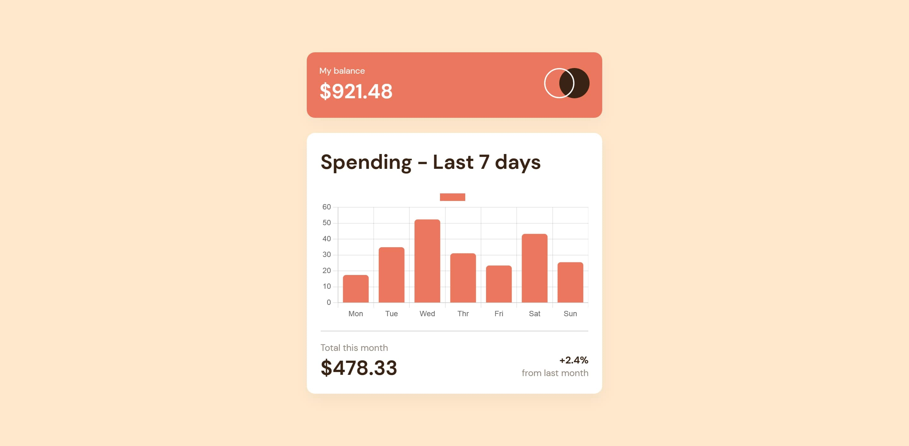
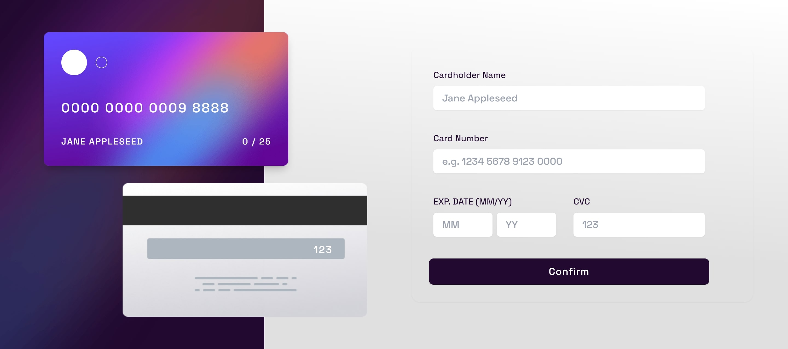
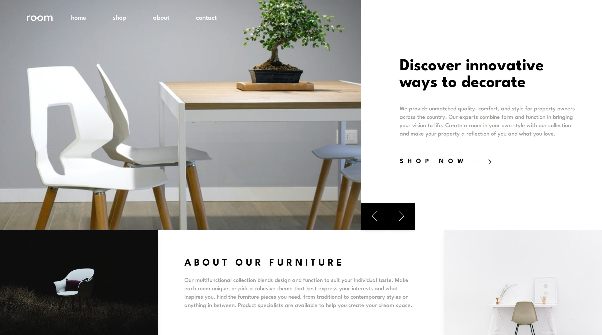
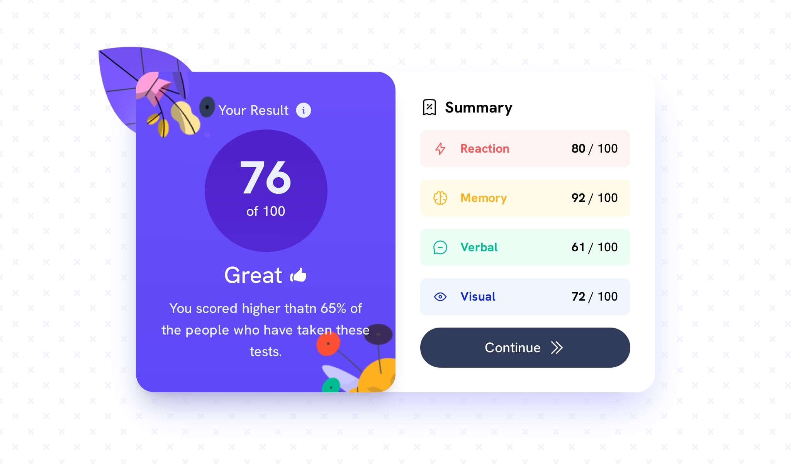
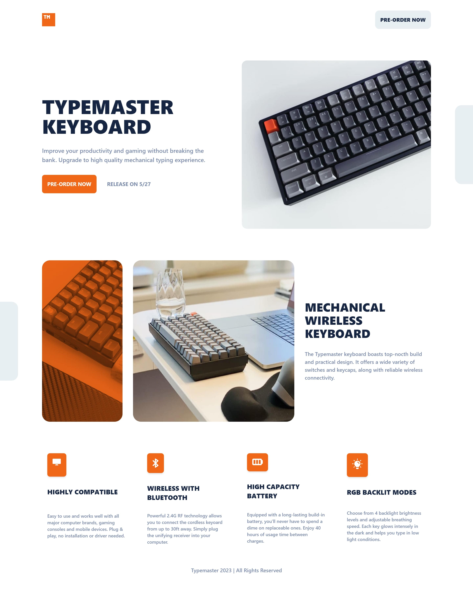

# React Project

This folder contains all the basic React Project.

## Previews:-

### Expenses Chart :-

- [Live Site](https://expenses-chart-singh.netlify.app/) |
  [Github](https://github.com/SameerJS6/React-Projects/tree/master/Expenses-Chart)

### E-Commerce Product Page :-

.jpg>)

- [Live Site](https://sneaker-sameer.netlify.app/) |
  [Github](https://github.com/SameerJS6/React-Projects/tree/master/E-Commerce-Product-Page)

### Interactive Card Component :-

- [Live Site](https://interactive-card-singh.netlify.app/) |
  [Github](https://github.com/SameerJS6/React-Projects/tree/master/Interactive-Card-Component)

### Sunnyside Agency Landing Page :-

- [Live Site](https://sunnyside-agency-singh.netlify.app/) |
  [Github](https://github.com/SameerJS6/React-Projects/tree/master/Sunnyside-Agency-Landing-Page)

### Room Homepage with GSAP :-

- [Live Site](https://home-sameer.netlify.app/) |
  [Github](https://github.com/SameerJS6/React-Projects/tree/master/Room-Homepage)

### Advice Generator :-

- [Live Site](https://advice-generator-singh.netlify.app/) |
  [Github](https://github.com/SameerJS6/React-Projects/tree/master/Basic-Advice-Generator)

### Result Summary :-

- [Live Site](https://result-summary.netlify.app/) |
  [Github](https://github.com/SameerJS6/React-Projects/tree/master/Results-Summary-Frontend-Mentor)

### Typemaster Landing Page :-

- [Live Site](https://typemaster-landing.netlify.app/) |
  [Github](https://github.com/SameerJS6/React-Projects/tree/master/Typemaster-Landing-Page)
